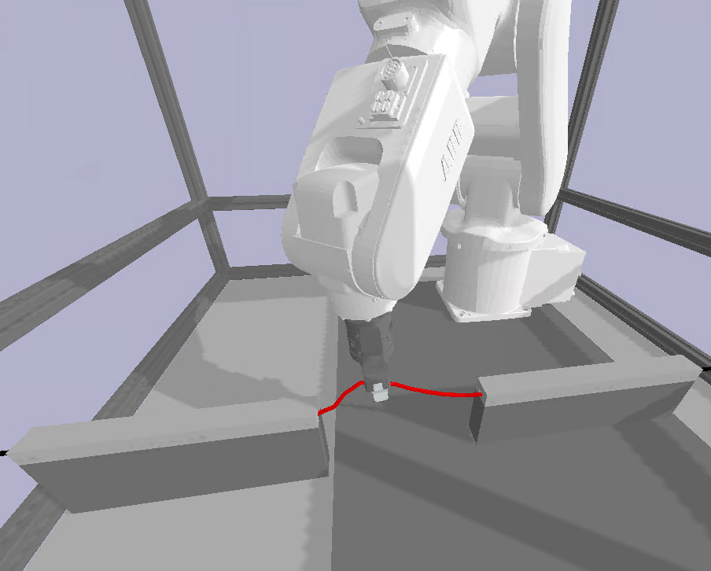

#  AIN4745 - REINFORCEMENT LEARNING FOR INDUSTRIAL ROBOTICS
 

*RL implementation for industrial robot (IRB 120 - ABB's 6 axis robot) - Testing 9/4/2021.*

<table>
  <tr>
    <td>RL simulation environment</td>
     <td>RL as an MDP</td>
  </tr>
  <tr>
    <td></td>
    <td></td>
  </tr>
 </table>

## Getting Started

### Prerequisites
 
* PyBullet
* [Pytorch](https://pytorch.org/)
* Python 3+
* Numpy
* Anaconda for environment management is recommended

### Installing

*How should they install the application. E.g. download the trunk and launch within the UnityEditor.*

*Include an image/animated GIF of what success looks like.*

### Building

*Describe how to build the application and general settings. Any specific should be included in specific guides on the wiki / pages section. What is needed to build should be already be included in prerequisites*

### Running the tests

No tests are implemented for this project.

### Coding Style

Coding style adheres to AMRC coding practices.

## Deployment

*Describe how you deploy the built application. Just an .exe that is run vs pointing to specific guides on the wiki / pages.*

## Contributing

Please only contribute if assigned to work on the project.
Development practice follows [link](https://datasift.github.io/gitflow/IntroducingGitFlow.html).

## Versioning

This project is using [SemVer](http://semver.org/) for versioning. For the versions available, see the [tags on this repositiory](https://github.com/your/project/tags).

## Authors

* **Lloyd Tinkler** - *PM* - [me1num](http://amrcgithub.shef.ac.uk/me1num)
* **Edwin Anarcaya Roca** - *Developer* - [me1elar](http://amrcgithub.shef.ac.uk/me1elar)

See also the list of [contributors](http://amrcgithub.shef.ac.uk/IMG/LINK_TO_PROJECT/graphs/contributors) who participated in this project.

## License

This project is funded under *Catapult*.

*Also include any links to collaberation agreements for future staff members wanting to understand if they can use the codebase.*

## Acknowledgments

*This markdown sheet is quite handy! [Link](https://github.com/adam-p/markdown-here/wiki/Markdown-Cheatsheet)*
